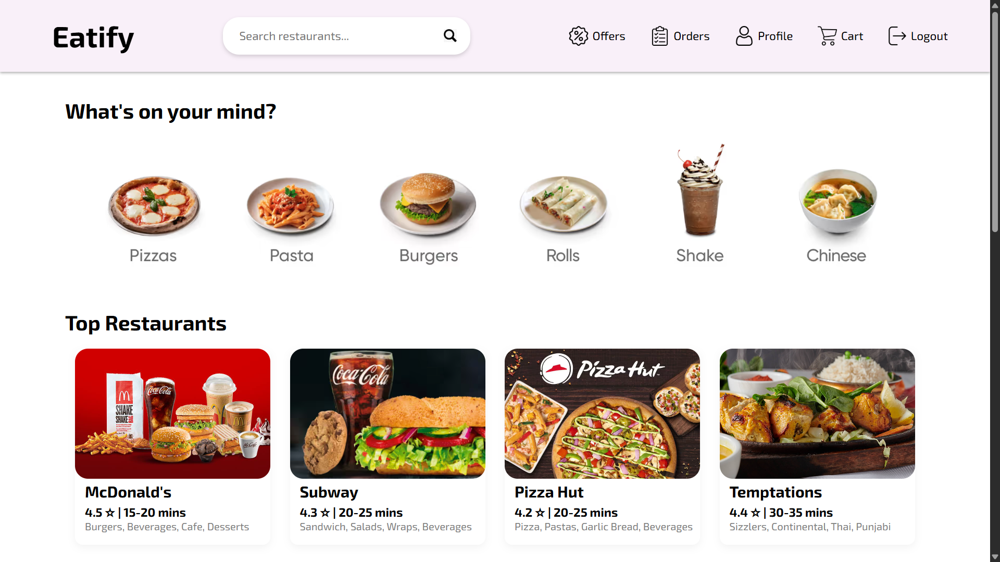
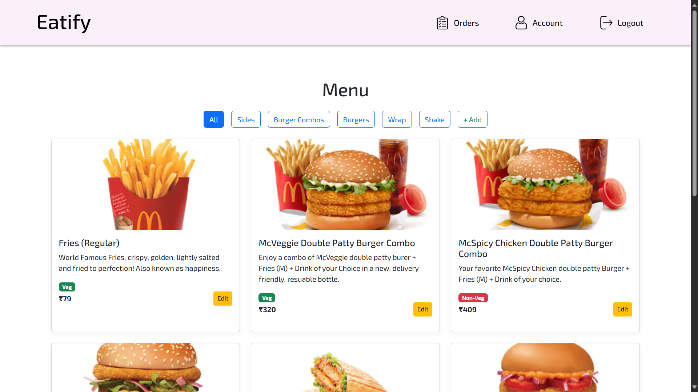
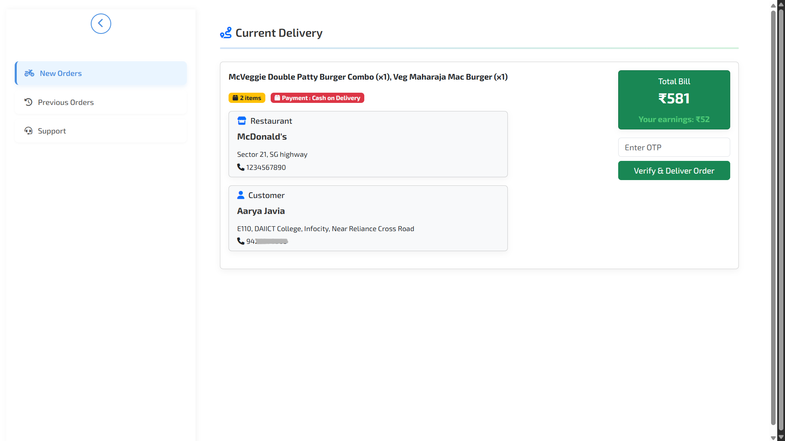
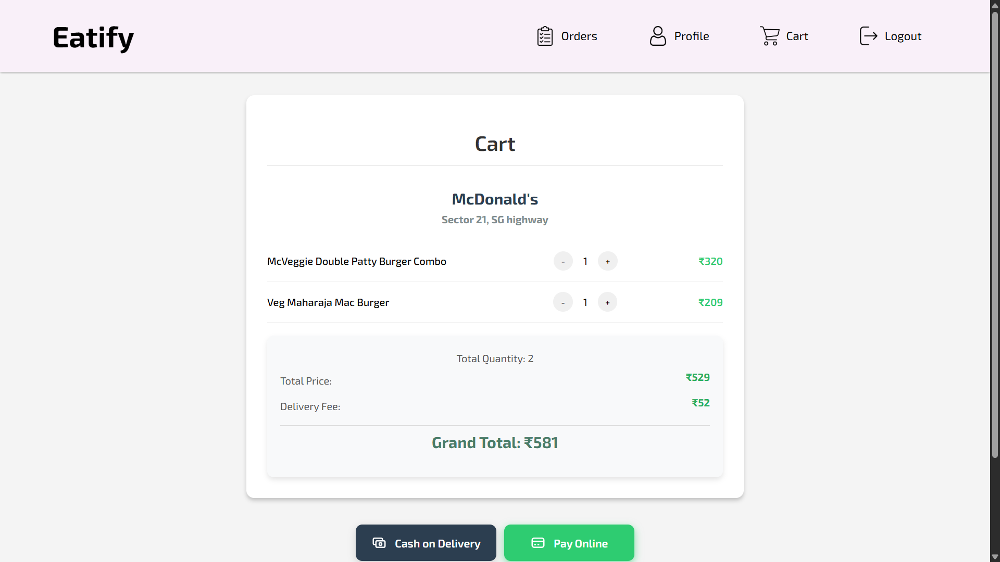
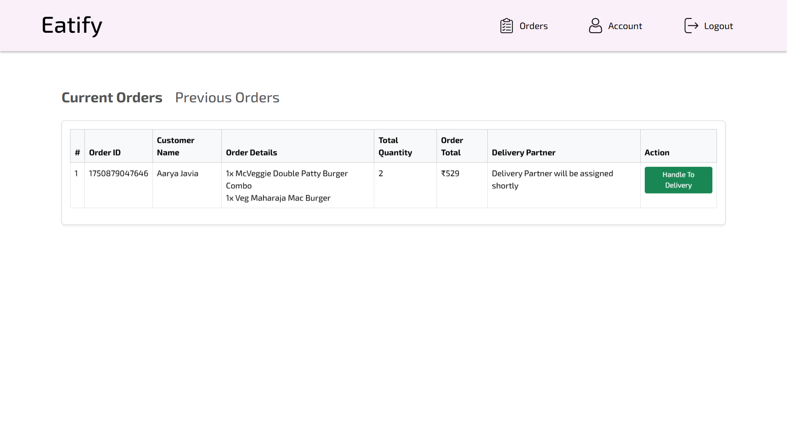

# 🍽️ Eatify – Fullstack Food Delivery App

Eatify is a robust, fullstack food delivery platform inspired by leading services like Swiggy and Zomato. Built using the MERN stack (MongoDB, Express.js, React.js, Node.js), Eatify enables seamless interaction between three distinct user roles — Customers, Restaurants, and Delivery Partners — each with their own dedicated dashboard and functionalities. Customers can browse restaurants, place orders, track deliveries in real-time, and make secure payments online or via cash on delivery. Restaurants have powerful tools to manage menus, accept orders, and view earnings, while delivery partners can manage and track assigned deliveries with OTP-based verification. Eatify also features JWT-based authentication, email notifications, and payment gateway integration using Razorpay, offering a real-world, end-to-end experience of how modern food delivery apps operate behind the scenes.

## 🔗 Repositories
 - Frontend (React.js) - https://github.com/aarya1708/eatify-frontend
 - Backend (Express.js, Node.js) - https://github.com/aarya1708/eatify-backend

## 🌐 Live Demo
You can check out Eatify live here:
👉 https://eatify-frontend.vercel.app

## 🚀 Features

👤 Customer
 - User authentication (Sign Up / Login)
 - Browse restaurants and menu items
 - Add items to cart and place orders
 - Online payment via Razorpay (Test Mode)
 - Cash on Delivery (COD) support
 - View order history and live order tracking
 - Access profile information (total spend, personal details)
 - View active offers
 - Search for restaurants
 - Logout securely

🍽️ Restaurant
 - Add / update / delete menu items
 - Create and manage menu categories
 - Accept or reject incoming orders
 - View order details with real-time delivery status
 - View past orders
 - Search orders by ID or date
 - View profile and total earnings

🛵 Delivery Partner
 - View and accept delivery requests
 - Access order details, restaurant information, and customer address
 - See payment mode (Online or COD)
 - View past deliveries
 - View earnings

## 🧑‍💻 Tech Stack

 - Frontend: React.js, Axios, Bootstrap CSS
 - Backend: Node.js, Express.js
 - Database: MongoDB
 - Authentication: JWT Tokens
 - Payment Gateway: Razorpay (Test Mode)
 - Email Service: Nodemailer (for OTP verification)
 - State Management: React State / Context API
 - Deployment: Vercel (Frontend) + Vercel (Backend)

## 🔧 Core Integrations

 - 🔐 Token-based authentication
 - 🔄 Real-time order tracking
 - 🛂 Multi-role login system
 - 📧 OTP-based delivery verification via email (Nodemailer)
 - 💳 Online payment using Razorpay (Test Mode)
 - 🌐 MongoDB for scalable data management
 - 📦 RESTful API with proper error handling

## 🧩 System Modules

 - Customer Interface
 - Restaurant Admin Panel
 - Delivery Partner Dashboard

Each module is independently authenticated and has tailored functionality as described in the features section.

## 📸 Screenshots

 - 👤 Customer Dashboard

 - 🍽️ Restaurant Dashboard

 - 🚴 Delivery Partner Interface

 - 🛒 Customer Cart

- 📋 Live Order Management

## 📈 Future Enhancements

 - AI-based restaurant recommendation system
 - Integration of maps for route optimization
 - Delivery partner location tracking via GPS

## ⚠️ Disclaimer

This project is built purely for educational and demonstration purposes.
It is not affiliated with or endorsed by any real brands or restaurants, including but not limited to 'Subway', 'Pizza Hut' or others used in this demo.
All logos, names, and references are used only for showcasing features and do not represent actual partnerships.
Eatify is not intended for real-world production use.
